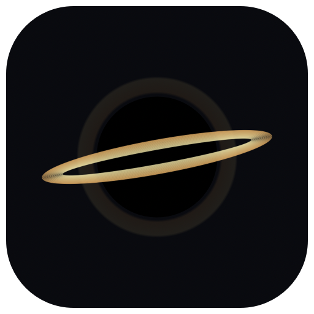

# 奇点 · Singularity



A native macOS black-hole desktop pet with live desktop lensing, draggable positioning, configurable visual families, random roaming, and custom accretion-disk colors.

一个能扭曲真实桌面背景的原生 macOS 黑洞桌宠。

## 下载与安装

从 [Releases](https://github.com/zhrhaozi/singularity-desktop/releases) 下载 DMG，将「奇点.app」拖到「应用程序」。

- Apple Silicon（M 系列），macOS 13 或更高版本。
- 本地 ad-hoc 签名，**未通过 Apple Developer ID 公证**。组织或系统安全策略可能阻止启动；请遵循设备的安全策略。
- 录屏画面仅在本机内存中参与渲染，不保存、不上传，不采集系统音频。

## 功能

| 功能 | 配置 |
| --- | --- |
| 黑洞分型 | Schwarzschild、Kerr、Reissner–Nordström、Kerr–Newman |
| 分型参数 | 质量尺度、自旋方向与强度、电荷；按分型显示 |
| 吸积盘 | 炽金、冷蓝、星环、纯透镜 |
| 外观参数 | 大小、透镜强度、亮度、倾角、画面旋转、盘面流动速度 |
| 自定义颜色 | macOS 颜色选择器、`#RRGGBB` 或 `#RGB` 输入 |
| 桌面漫游 | 5–180 pt/s；随机转向、边缘随机向内折返 |
| 交互 | 拖动、双击/右键设置、菜单栏入口、隐藏、参数与位置保存 |

关闭设置后开始漫游。鼠标靠近、拖动或打开设置时暂停，方便操作；隐藏时停止桌面采样。移动范围限定在当前显示器的可用区域，避开菜单栏和 Dock。

自定义颜色只作用于吸积盘，保留背景原色。**纯透镜模式没有吸积盘，选择其他风格才能看到盘色变化。** 错误 HEX 输入会保留上次有效颜色。

## 物理模型的范围

Schwarzschild 模式沿用上游着色器的数值光线积分。Kerr 及带电分型是在该基础上实现的**视觉近似**，用局部坐标扭曲、偏移、尺寸变化及盘面参数表达不同外观，**不是精确求解 Kerr / Kerr–Newman 度规的光线追踪器**。

质量尺度是视觉倍率；自旋、电荷是无量纲控制量。Kerr–Newman 模式限制有效电荷，使 `a*² + q*² ≤ 0.98²`。它是桌面视觉应用，不应用于科学计算。

## 录屏权限

点击「开启桌面透镜」，按系统提示授权。若没有申请弹窗或没有列表条目：

1. 进入「系统设置 → 隐私与安全性 → 录屏与系统录音」。
2. 使用**上方录屏列表**的「＋」，选择 `/Applications/奇点.app`。
3. 完成系统验证、开启权限，然后退出并重新打开奇点。

ad-hoc 构建更新后可能出现“开关已开，但无法连接”，因为旧条目仍绑定旧二进制签名。此时通过系统设置移除**奇点这一项**，再添加当前应用并重启。不要修改系统 TCC 数据库或重置其他应用权限。

## 从源码构建

需要 Xcode Command Line Tools 和包含 ScreenCaptureKit 的 macOS SDK。

```sh
xcode-select --install
git clone https://github.com/zhrhaozi/singularity-desktop.git
cd singularity-desktop
./scripts/test.sh
./build.sh
open dist/奇点.app
```

构建目标固定为 `arm64-apple-macosx13.0`。构建脚本不依赖第三方包，输出应用到 `dist/`，也支持 `./build.sh /absolute/output/directory`。

打包 DMG、ZIP 并生成 SHA-256：

```sh
./scripts/package.sh
```

## 实现与验证

- AppKit / SwiftUI：原生浮动窗口和设置面板。
- ScreenCaptureKit：采集显示器画面，排除宠物窗口以避免反馈。
- OpenGL 3.2：渲染上游 GLSL 的适配版本。OpenGL 已被 Apple 弃用，此版本仍使用它；长期迁移目标可考虑 Metal。
- `Behavior.swift`：颜色解析、随机漫游和边界约束。
- `scripts/test.sh`：颜色合法性、速度单位、负坐标屏幕及连续 16 万步边界检查。

1.1 已在 Apple Silicon macOS 上验证启动、授权后桌面透镜、自定义颜色和实际移动。多实体显示器切换未实测；目标 30 FPS，实际性能因设备和负载不同而变化。CI 检查编译及纯逻辑测试，不代替桌面视觉验证。

## 致谢与许可

渲染基础来自 [s0xDk/ghostty-blackhole](https://github.com/s0xDk/ghostty-blackhole)，原作者 s13k，MIT 许可。保留原始署名，详见 [第三方许可](Resources/THIRD-PARTY-LICENSE.txt)。

本项目新增 macOS 桌面捕获、原生窗口与设置、拖动、漫游、分型视觉控制、自定义颜色及打包。

分型背景参考：[Einstein Online](https://www.einstein-online.info/en/spotlight/Rotating-Black-Holes-Observations-and-Working-in-General-Relativity/)、[Kerr–Newman metric / Scholarpedia](https://www.scholarpedia.org/article/Kerr-Newman_metric)。

项目采用 [MIT License](LICENSE)。
